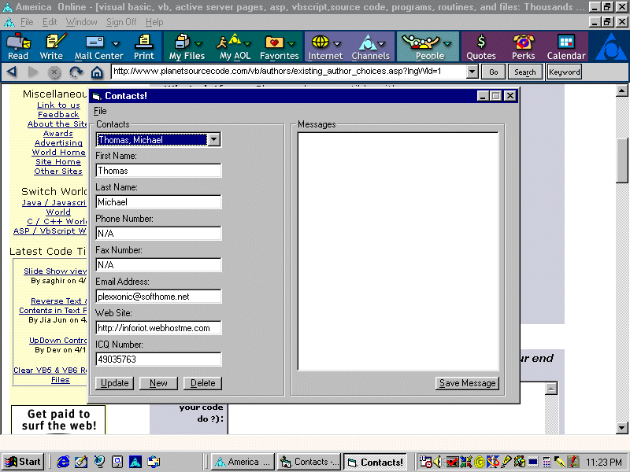



## Step 1 Of A Network Messaging System

### Description

This is the first part of a network messaging system. This part is inteaded to show examples of connecting to a Microsoft Access Database and its related functions. It is highly commented. The next part will have the code to setup an "Inbox" feature that will check the database and see if you have any messages.
 
### More Info
 
Make sure your refrence the DAO 3.5 Library under Project/Refrences.

             |
---                |---
**Submitted On**   |2000-04-01 23:26:56
**By**             |[PleX](https://github.com/Planet-Source-Code/PSCIndex/blob/master/ByAuthor/plex.md)
**Level**          |Beginner
**User Rating**    |5.0 (15 globes from 3 users)
**Compatibility**  |VB 5\.0, VB 6\.0
**Category**       |[Complete Applications](https://github.com/Planet-Source-Code/PSCIndex/blob/master/ByCategory/complete-applications__1-27.md)
**World**          |[Visual Basic](https://github.com/Planet-Source-Code/PSCIndex/blob/master/ByWorld/visual-basic.md)
**Archive File**   |[CODE\_UPLOAD4463412000\.zip](https://github.com/Planet-Source-Code/plex-step-1-of-a-network-messaging-system__1-6941/archive/master.zip)

### API Declarations

Nope

